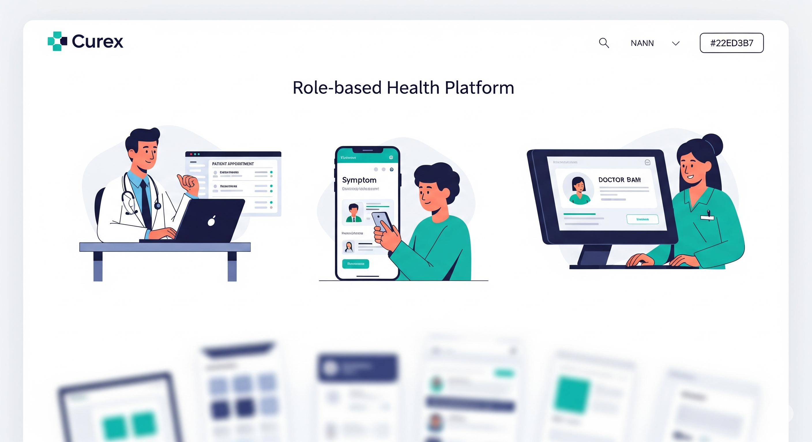
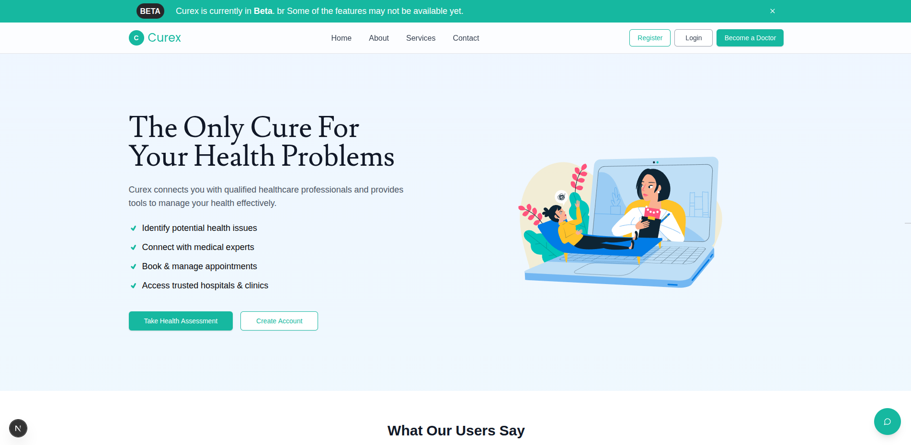

# Curex

Curex is a role-based health platform built for patients, doctors, and administrators. It provides a complete system for health consultation, video calls, and symptom assessment.

## Screenshots

  
  
  
  
  

## Features
- Role-based login (Patient, Doctor, Admin)
- Admin dashboard for doctor verification
- Patient dashboard with symptom test history
- Doctor dashboard to manage appointments
- Multi-step symptom assessment with result tracking
- LiveKit-powered video consultations
- Filters, search, and skeleton loading for better UX
## Tech Stack
- Next.js
- PostgreSQL
- Prisma
- LiveKit
- Tailwind CSS
- Shadcn/ui
- Zustand
## Getting Started
1. Clone the repository  
2. Install dependencies:  
bash
npm install

3. Set up your .env file based on .env.example  
4. Run the development server:  
bash
npm run dev

## Folder Structure

/app           - Next.js App Directory
/components    - Shared UI components
/lib           - Utilities and helpers
/prisma        - Database schema and seed
/public        - Static files
/store         - Global state management

## Future Improvements
- Real-time appointment updates
- Notifications
- Doctor-patient chat
- Analytics for admins
---
Built with care for the Curex project.

i think we have to add those public too. look at homepage.png
